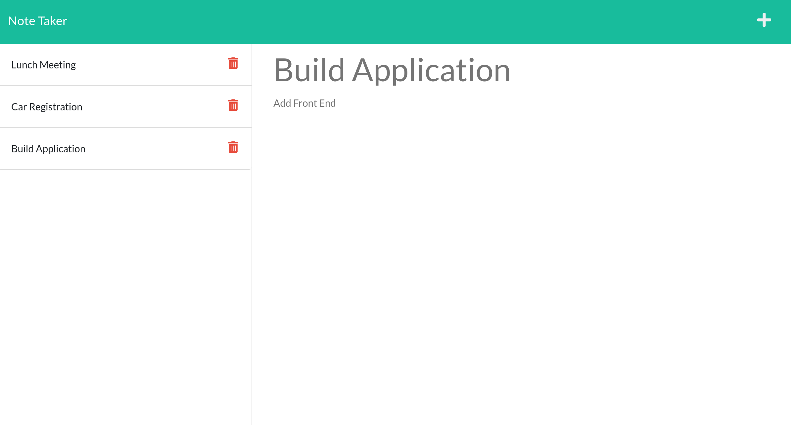

# Note Taker

## Description
An application that saves and retrieves note data created by the user

## User Story
As a small business owner, I want to be able to write and save notes so that I can organize my thoughts and keep track of tasks I need to complete

## Made with
* HTML
* CSS
* JavaScript
* Node.js

## Application
[Note Taker Application Link](https://afternoon-temple-41959.herokuapp.com/)

## Snapshot

## Packages
* Jest
* Express
* UniqueId

## Tests
* Run <code>npm test</code>

## Criteria
GIVEN a note-taking application
* WHEN I open the Note Taker THEN I am presented with a landing page with a link to a notes page
* WHEN I click on the link to the notes page THEN I am presented with a page with existing notes listed in the left-hand column, plus empty fields to enter a new note title and the note’s text in the right-hand column
* WHEN I enter a new note title and the note’s text THEN a Save icon appears in the navigation at the top of the page
* WHEN I click on the Save icon THEN the new note I have entered is saved and appears in the left-hand column with the other existing notes
* WHEN I click on an existing note in the list in the left-hand column THEN that note appears in the right-hand column
* WHEN I click on the Write icon in the navigation at the top of the page THEN I am presented with empty fields to enter a new note title and the note’s text in the right-hand column

## Contribution
Made by Angela Man